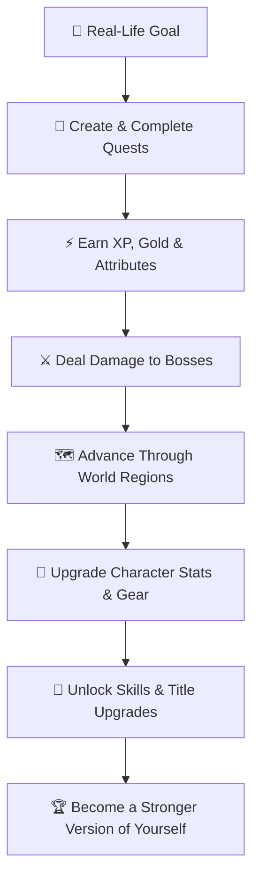

<div align="center">

# ⚔️ HUSTLE ⚔️
### *Turn Real Life Into Your Game*

[](https://react.dev/)
[](https://vitejs.dev/)
[](https://tailwindcss.com/)
[](https://www.python.org/)
[](https://flask.palletsprojects.com/)
[](LICENSE)

<br />

**HUSTLE** is an RPG-powered productivity and personal growth platform that converts your real-life goals and daily habits into quests, XP, character progression, epic boss fights, and an evolving game world.

*Stop checking off boring to-do lists. Turn your life into an adventure.*

</div>

---

## 🎮 The Idea

Traditional productivity apps tell you what you need to do.

**HUSTLE** asks:
> **"What if your real life was the game?"**

Your everyday actions become quests. Complete quests to earn:

- ⚡ **XP** (Level up your character)
- 🪙 **Gold** (Purchase weapons, armor, & potions in the Shop)
- 📈 **Attributes** (Build Strength, Intelligence, Discipline, Vitality & Agility)
- 🧠 **Skill Points** (Unlock nodes in the skill tree)
- 🏆 **Achievements** (Unlock badges for major real-world milestones)
- 🔥 **Streaks** (Maintain consistency multipliers)

---

## ⚔️ The Core Gameplay Loop



---

## ✨ Key Features

### 📜 Quest System & Habit Tracker
- Categorize real-world tasks into **Main Quests**, **Side Quests**, and **Daily Habits**.
- Set difficulty levels (Easy, Medium, Hard, Legendary) with dynamic XP and stat yield.
- Attributes assigned to quests directly boost corresponding character stats.

### 🐉 Epic Boss Battles
- Create custom real-life challenges as **Boss Enemies** (e.g. *"Exam Monster"*, *"Marathon Titan"*).
- Every completed quest hits the boss with damage derived from your character attributes.
- Defeat bosses to earn legendary loot, titles, and massive gold rewards.

### 🧙 Character Progression & Stat Sheet
- Level up through XP and distribute attribute points across:
  - 💪 **Strength**: Fitness & physical endurance
  - 🧠 **Intelligence**: Learning, reading, & skill mastery
  - 🔥 **Discipline**: Habit consistency & task completion
  - 🛡️ **Vitality**: Sleep, recovery, & health
  - ⚡ **Agility**: Speed & quick wins
- Equip gear, unlock titles, and inspect your full character sheet.

### 🌳 Skill Trees & Perks
- Spend skill points earned at level milestones to unlock passive buffs.
- Enhance XP multipliers, gold find rates, streak protection, and boss critical strikes.

### 🛍️ Item Shop & Armory
- Spend hard-earned gold on consumables (HP Potions, XP Elixirs) and equipment.
- Custom real-world rewards store: turn gold into real-life treats (e.g. cheat meals, gaming sessions).

### 🗺️ Evolving World Map & Regions
- Progress through fantasy zones (e.g., *The Starting Village*, *Iron Citadel*, *Celestial Peaks*).
- Zone progression reflects real-world consistency and long-term level achievements.

### 📊 Analytics & Habit Tracking
- Visualize productivity stats, attribute distributions, and weekly quest completion rates powered by **Recharts**.

### 🤖 AI Game Master Integration
- Optional AI module (OpenAI/Anthropic/Mock engine) to generate immersive narrative questlines and boss lore tailored to your goals.

---

## 🛠️ Technology Stack

| Domain | Technology | Description |
| :--- | :--- | :--- |
| **Frontend Framework** | React 18 + Vite 5 | Fast SPA architecture with hot module replacement |
| **Styling** | Tailwind CSS 3 | Modern dark-mode UI with custom glassmorphism components |
| **Icons & Charts** | Lucide React + Recharts | Responsive iconography and stat visualizations |
| **Routing & HTTP** | React Router v6 + Axios | Client-side routing and REST API client |
| **Backend API** | Python 3.12 + Flask 3.0 | Lightweight RESTful microservice framework |
| **Database & ORM** | SQLite / PostgreSQL + Flask-SQLAlchemy | Flexible relational schema for user stats and game data |
| **Authentication** | Flask-JWT-Extended + bcrypt | Secure JWT tokens with password hashing |
| **Testing** | pytest + pytest-flask | Automated API integration and unit testing |

---

## 📂 Project Structure

```text
hustle/
├── backend/
│   ├── app/
│   │   ├── models/          # SQLAlchemy Models (User, Quest, Boss, Character, Skill)
│   │   ├── routes/          # REST API endpoints (Auth, Quests, Bosses, Character, Shop)
│   │   ├── services/        # Business logic & AI Game Master engine
│   │   └── config.py        # Environment configurations
│   ├── run.py               # Flask entry point
│   ├── seed.py              # Database seeder (Demo character & default items)
│   ├── seed_skills.py       # Skill tree initializer
│   └── requirements.txt     # Python dependencies
│
└── frontend/
    ├── src/
    │   ├── api/             # Axios API client modules
    │   ├── components/      # Reusable UI components (Navbar, QuestCard, StatBar)
    │   ├── context/         # Auth & Game state React Context
    │   ├── pages/           # Views (Dashboard, Quests, Bosses, Character, Shop, World)
    │   ├── App.jsx          # React app routes
    │   └── main.jsx         # React root entry
    ├── package.json         # Frontend dependencies & scripts
    └── vite.config.js       # Vite build & proxy settings
```

---

## 🚀 Quick Start Guide

### Prerequisites
- **Node.js** v18+ and **npm**
- **Python** 3.10+

### 1️⃣ Clone the Repository
```bash
git clone https://github.com/kingzrag/hustle.git
cd hustle
```

### 2️⃣ Backend Setup
```bash
cd backend

# Create & activate a virtual environment
python -m venv venv
# On Windows:
venv\Scripts\activate
# On macOS/Linux:
# source venv/bin/activate

# Install dependencies
pip install -r requirements.txt

# Create .env file (or copy from .env.example)
cp .env.example .env

# Seed initial database & skill tree
python seed.py
python seed_skills.py

# Start Flask backend server (Runs on http://localhost:5002)
python run.py
```

### 3️⃣ Frontend Setup
In a new terminal window:
```bash
cd frontend

# Install Node modules
npm install

# Create .env file (or copy from .env.example)
cp .env.example .env

# Start Vite dev server (Runs on http://localhost:5173 or 5174)
npm run dev
```

---

## 🔑 Demo Account Credentials

After running `python seed.py`, log in with the default demo account:

- **Username**: `aelindra`
- **Password**: `password123`

---

## 🔌 API Endpoint Summary

| Endpoint | Method | Description |
| :--- | :--- | :--- |
| `/api/auth/login` | `POST` | Authenticate user & receive JWT token |
| `/api/dashboard` | `GET` | Fetch overall user level, stats, active quests, and current boss |
| `/api/quests` | `GET` / `POST` | Fetch all quests or create a new real-life quest |
| `/api/quests/<id>/complete` | `POST` | Complete quest, receive XP/Gold, and damage active boss |
| `/api/bosses` | `GET` / `POST` | Manage active boss fights and spawn new bosses |
| `/api/character` | `GET` / `PUT` | View character attributes and allocate level-up points |
| `/api/skills` | `GET` / `POST` | View skill tree and purchase skills |
| `/api/shop` | `GET` / `POST` | View item shop and purchase items |

---

## 🤝 Contributing

Contributions, issues, and feature requests are welcome!  
Feel free to check out the [Issues page](https://github.com/kingzrag/hustle/issues).

---

## 📜 License

Distributed under the MIT License. See `LICENSE` for more information.
