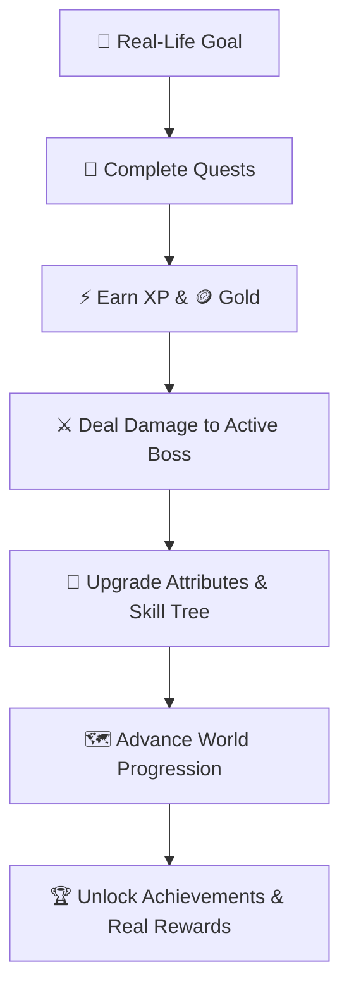

<div align="center">

# ⚔️ HUSTLE ⚔️
### *Turn Real Life Into Your Game.*

[](https://react.dev/)
[](https://vitejs.dev/)
[](https://tailwindcss.com/)
[](https://www.python.org/)
[](https://flask.palletsprojects.com/)
[](LICENSE)

An RPG-powered productivity platform that transforms your goals, habits, and daily tasks into quests, XP, character progression, boss battles, rewards, and an evolving game world.

**🎯 Set Goals → 📜 Complete Quests → ⚡ Earn XP → 🐉 Defeat Bosses → 🏆 Level Up**

🚀 **[LIVE DEMO](https://hustle-omega-green.vercel.app/)** • 💻 **[SOURCE CODE](https://github.com/drax-glitch/hustle)**

</div>

---

## 🎮 What is HUSTLE?

**HUSTLE** turns productivity into an RPG.

Instead of treating your daily responsibilities as boring checklist items, HUSTLE transforms them into an interactive progression system.

- Your real-world goals become **Quests**.
- Completing quests earns **XP** and **Gold**.
- Your progress improves your **Character Attributes**.
- Major challenges become **Boss Battles**.
- Long-term progress unlocks **Skills**, **Rewards**, **Achievements**, and **New Areas**.

```text
🎯 Goal ↓ 📜 Quest ↓ ✅ Complete ↓ ⚡ XP + 🪙 Gold ↓ 📈 Character Progression ↓ 🐉 Boss Damage ↓ 🏆 Rewards ↓ 🌎 New Progression
```

> **Your real life is the game. Your actions are the gameplay.**

---

## 💡 The Problem

Traditional productivity applications are excellent at tracking tasks, but tracking alone doesn't always create motivation.

Users often experience:
- 📋 **Repetitive task lists**
- 😴 **Motivation dropping over time**
- 🔄 **Difficulty maintaining habits**
- 📉 **Progress that feels invisible**
- 🎯 **Long-term goals disconnected from daily actions**
- 🏆 **Little sense of achievement**

The problem isn't always knowing *what* to do. It's staying motivated to keep doing it.

---

## ⚔️ Our Solution

HUSTLE combines:

$$\text{PRODUCTIVITY} + \text{GAMIFICATION} + \text{RPG PROGRESSION} \longrightarrow \text{HUSTLE}$$

It turns everyday progress into a game loop:

| Real Life | HUSTLE |
| :--- | :--- |
| 🎯 **Goal** | Mission |
| 📋 **Task** | Quest |
| 🔥 **Habit** | Daily Quest |
| 📈 **Progress** | XP |
| 💪 **Fitness** | Strength |
| 🧠 **Learning** | Intelligence |
| ⚔️ **Consistency** | Discipline |
| 😈 **Major Challenge** | Boss |
| 🏆 **Milestone** | Achievement |
| 🪙 **Reward** | Gold |
| 🌎 **Long-Term Growth** | World Progression |

---

## 🕹️ Core Gameplay Loop

The entire experience revolves around:

$$\text{Action} \longrightarrow \text{Reward} \longrightarrow \text{Progression} \longrightarrow \text{Motivation} \longrightarrow \text{Action}$$



---

## ✨ Key Features

### 📜 Quest System
Turn everyday responsibilities into RPG quests.

#### Quest Types
- ⚔️ **Main Quests**: Major goals and high-impact objectives.
- 📜 **Side Quests**: Smaller optional tasks and quick wins.
- 🔥 **Daily Quests**: Recurring habits and daily routines.

#### Quest Difficulty & Rewards
| Difficulty | Effort | Reward Yield |
| :--- | :--- | :--- |
| 🟢 **Easy** | Low | Small XP |
| 🟡 **Medium** | Moderate | Medium XP |
| 🔴 **Hard** | High | Large XP |
| 🟣 **Legendary** | Extreme | Massive XP + Stat Bonus |

---

### 🐉 Boss Battles
Major real-world challenges become Boss Battles.

**Examples:**
- 📚 *Exam Monster*
- 💻 *Coding Titan*
- 🎯 *Project Overlord*
- 📖 *Procrastination Demon*
- 🏃 *Marathon Beast*

Instead of defeating bosses through traditional combat, users defeat them through real-world progress. Every completed quest contributes damage toward the active boss.

```text
🐉 EXAM MONSTER HP  ████████████░░░░  72%
⚔️ Quest: Complete 2 chapters  ✓ QUEST COMPLETED
💥 BOSS DAMAGE  |  ⚡ XP EARNED  |  🪙 GOLD EARNED
```

---

### 🧙 Character Progression
Every meaningful action contributes to character development.

#### Character Attributes
- 💪 **Strength**: Fitness and physical activity
- 🧠 **Intelligence**: Learning and knowledge
- ⚔️ **Discipline**: Consistency and task completion
- 🛡️ **Vitality**: Recovery and healthy routines
- ⚡ **Agility**: Speed and execution

```text
QUEST  ↓  XP  ↓  LEVEL UP  ↓  ATTRIBUTE POINTS  ↓  STRONGER CHARACTER  ↓  BIGGER CHALLENGES
```

---

### 🌳 Skill Tree
Players can use earned skill points to unlock additional abilities and bonuses.

```text
               🌳 SKILL TREE
                     │
         ┌───────────┴───────────┐
         │                       │
    ⚡ XP BOOST             🪙 GOLD FIND
         │                       │
    ┌────┴────┐             ┌────┴────┐
    │         │             │         │
🔥 STREAK   💥 CRIT     🎁 LOOT     🛡️ SHIELD
```

**Possible Upgrades:**
- ⚡ **XP Bonuses**
- 🪙 **Gold Bonuses**
- 🔥 **Streak Protection**
- 💥 **Critical Damage**
- 🎁 **Loot Bonuses**
- 📈 **Attribute Improvements**

---

### 🛍️ Shop & Rewards
Completing quests earns Gold. Gold can be spent in the HUSTLE reward system.

**Reward Categories:**
- ⚔️ Equipment
- 🛡️ Armor
- ❤️ Potions & Consumables
- ⚡ XP Boosters
- 🎁 Custom Real-World Rewards (e.g. cheat meal, gaming hour)

```text
COMPLETE QUEST  ↓  🪙 GOLD  ↓  REWARD  ↓  MOTIVATION  ↓  MORE PROGRESS
```

---

### 🗺️ Evolving World
HUSTLE represents long-term growth through an evolving game world.

```text
🏡 The Starting Village  ↓  🏰 Iron Citadel  ↓  🌲 Whispering Forest  ↓  🔥 Ember Wastelands  ↓  ☁️ Celestial Peaks
```

The world gives users a visual representation of their journey and progression.

---

### 🔥 Streaks & Consistency
Consistency is a core part of personal growth. HUSTLE turns repeated actions into streaks that encourage users to maintain momentum.

```text
DAY 1 🔥  ──>  DAY 2 🔥  ──>  DAY 3 🔥  ──>  DAY 4 🔥  ──>  DAY 5 🔥  ↓  STREAK BONUS
```

---

### 📊 Analytics
Interactive visualizations powered by **Recharts** make progress measurable across:
- 📈 XP progression
- 📜 Quest completion rates
- 🔥 Habit streaks
- 💪 Attribute distribution
- 🪙 Gold earned
- 🐉 Boss progress
- 🏆 Achievements & milestone history

---

### 🤖 AI Game Master
The AI Game Master adds an immersive narrative layer to productivity.

> **Instead of:** *"Complete your assignment."*  
> **Game Master:** *"⚔️ QUEST: THE FORBIDDEN MANUSCRIPT — Ancient knowledge lies sealed within the library. Complete your study objective and weaken the Guardian of Procrastination."*

The AI layer supports:
- 📜 Quest narratives
- 🐉 Boss lore
- 🎯 Personalized challenges
- 🗺️ Story progression
- 🎭 Immersive descriptions

---

## 🏗️ System Architecture

### 🛠️ Technology Stack

| Layer | Technology | Purpose |
| :--- | :--- | :--- |
| 🎨 **Frontend** | React 18 | Interactive application |
| ⚡ **Build Tool** | Vite 5 | Fast development and builds |
| 🎨 **Styling** | Tailwind CSS 3 | Responsive RPG interface |
| 🧩 **Icons** | Lucide React | UI iconography |
| 📊 **Charts** | Recharts | Analytics and visualization |
| 🧭 **Routing** | React Router v6 | Client-side navigation |
| 🌐 **HTTP** | Axios | API communication |
| 🐍 **Backend** | Python 3.12 | Server-side logic |
| 🌶️ **API** | Flask 3 | REST API |
| 🗄️ **Database** | SQLite / PostgreSQL | Persistent game data |
| 🧱 **ORM** | Flask-SQLAlchemy | Database abstraction |
| 🔐 **Authentication** | JWT + bcrypt | Authentication and password hashing |
| 🧪 **Testing** | pytest + pytest-flask | Backend testing |
| 🚀 **Deployment** | Vercel / Render | Production hosting |

---

## 📂 Project Structure

```text
hustle/
├── backend/
│   ├── app/
│   │   ├── models/          # User, Quest, Boss, Character, Skill models
│   │   ├── routes/          # Auth, Quests, Bosses, Character, Shop routes
│   │   ├── services/        # Game logic & AI Game Master engine
│   │   └── config.py        # App configurations
│   ├── run.py               # Flask entry point
│   ├── seed.py              # Database seeder (Demo character & items)
│   ├── seed_skills.py       # Skill tree initializer
│   └── requirements.txt     # Backend dependencies
│
└── frontend/
    ├── src/
    │   ├── api/             # Axios API integration
    │   ├── components/      # RPG UI components
    │   ├── context/         # Auth & App state providers
    │   ├── pages/           # Dashboard, Quests, Bosses, Character, Shop, World
    │   ├── App.jsx          # Router & layout
    │   └── main.jsx         # App entry point
    ├── package.json         # Frontend dependencies
    └── vite.config.js       # Vite configuration
```

---

## 🔌 API Overview

| Endpoint | Method | Description |
| :--- | :--- | :--- |
| `/api/auth/login` | `POST` | Authenticate user & issue JWT |
| `/api/dashboard` | `GET` | Fetch user level, stats, quests, and active boss |
| `/api/quests` | `GET` / `POST` | Retrieve and create quests |
| `/api/quests/<id>/complete` | `POST` | Complete quest & receive XP, Gold & Boss Damage |
| `/api/bosses` | `GET` / `POST` | Manage active boss battles |
| `/api/character` | `GET` / `PUT` | View and upgrade character attributes |
| `/api/skills` | `GET` / `POST` | Browse and unlock skill nodes |
| `/api/shop` | `GET` / `POST` | Browse and purchase items |

---

## 🚀 Live Demo & Local Setup

### 🚀 Live Application
- **[Launch Live App](https://hustle-omega-green.vercel.app/)**

### 🔑 Demo Account Credentials
For local and live demo testing:
- **Username**: `aelindra`
- **Password**: `password123`

---

### 💻 Run Locally

#### Prerequisites
- **Node.js** 18+ & **npm**
- **Python** 3.10+

#### 1️⃣ Clone the Repository
```bash
git clone https://github.com/drax-glitch/hustle.git
cd hustle
```

#### 2️⃣ Backend Setup
```bash
cd backend
python -m venv venv

# Activate Virtual Environment
# Windows:
venv\Scripts\activate
# macOS/Linux:
# source venv/bin/activate

# Install dependencies
pip install -r requirements.txt

# Create environment file
cp .env.example .env

# Initialize and seed database
python seed.py
python seed_skills.py

# Start backend server (Runs on http://localhost:5002)
python run.py
```

#### 3️⃣ Frontend Setup
In a second terminal window:
```bash
cd frontend

# Install node dependencies
npm install

# Create environment file
cp .env.example .env

# Start dev server (Runs on http://localhost:5173 or 5174)
npm run dev
```

---

## 🏆 Hackathon Highlights

- 🎮 **Gamified Productivity**: Transforms conventional task management into an RPG progression system.
- ⚔️ **Real-World Boss Battles**: Turns large goals into tangible challenges that users progressively defeat.
- 📈 **Visible Personal Growth**: XP, levels, attributes, skills, and world progression make self-improvement tangible.
- 🔥 **Consistency Mechanics**: Streaks and recurring quests encourage users to keep showing up daily.
- 🤖 **AI-Powered Immersion**: The AI Game Master turns ordinary objectives into personalized RPG narratives.
- 🧩 **Extensible Architecture**: Modular frontend and backend structure designed for multi-platform expansion.

---

## 🔮 Roadmap

- 🎮 **Social RPG**: Parties, guilds, co-op boss battles, leaderboards, & shared challenges.
- 🤖 **Advanced AI**: Adaptive difficulty, dynamic quest generation, and personal AI coaching.
- 📱 **Platform Expansion**: Mobile app (iOS/Android), desktop notifications, & calendar integrations.
- 🌎 **Expanded World**: Additional map regions, character classes, equipment, and seasonal events.

---

## 🎯 Vision

HUSTLE is built around one core principle:  
**Make progress visible, rewarding, and fun.**

```text
A TASK ──> 📜 QUEST  |  A HABIT ──> 🔥 STREAK  |  A GOAL ──> 🎯 MISSION
A CHALLENGE ──> 🐉 BOSS  |  PROGRESS ──> ⚡ XP  |  GROWTH ──> 🏆 LEVEL UP
```

> **Don't just manage your life. Play it.**

---

## 🤝 Contributing & License

Contributions, ideas, issues, and feature requests are welcome!  
Feel free to open an issue or submit a pull request at **[github.com/drax-glitch/hustle](https://github.com/drax-glitch/hustle)**.

Distributed under the **MIT License**. See [`LICENSE`](https://github.com/drax-glitch/hustle/blob/main/LICENSE) for more information.

<div align="center">

### ⚔️ LEVEL UP YOUR LIFE ⚔️
*Your goals are the quests. Your consistency is your power. Your life is the game.*

🚀 **[PLAY HUSTLE](https://hustle-omega-green.vercel.app/)** • ⭐ **[STAR ON GITHUB](https://github.com/drax-glitch/hustle)**

</div>
